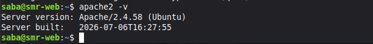
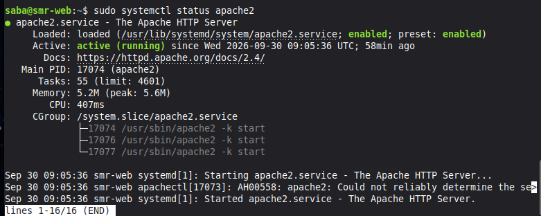
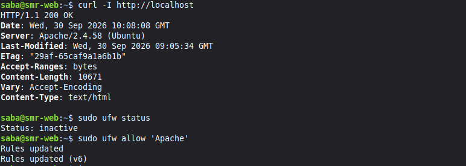

# Práctica: Instalación, configuración y securización de Apache en Ubuntu 24.04

- **Módulo:** Aplicaciones Web (SMR)
- **Alumno:** Saba Burjanadze
- **Fecha:** 30/09/2026

---

## Índice
1. [Preparación del sistema](#apartado-1-preparación-del-sistema)
2. [Instalación de Apache](#apartado-2-instalación-de-apache)
3. [Comprobación del funcionamiento](#apartado-3-comprobación-del-funcionamiento)
4. [Comandos principales de administración](#apartado-4-comandos-principales-de-administración)
5. [Ficheros y directorios importantes](#apartado-5-ficheros-y-directorios-importantes)
6. [Modificaciones típicas del servicio](#apartado-6-modificaciones-típicas-del-servicio)
7. [Módulos de Apache](#apartado-7-módulos-de-apache)
8. [Varios sitios en un mismo servidor (Virtual Hosts)](#apartado-8-varios-sitios-en-un-mismo-servidor-virtual-hosts)
9. [Permisos y propietarios](#apartado-9-permisos-y-propietarios)
10. [Mejoras de seguridad](#apartado-10-mejoras-de-seguridad)
11. [Comprobación del estado y diagnóstico de errores](#apartado-11-comprobación-del-estado-y-diagnóstico-de-errores)
12. [Conclusiones](#conclusiones)

---

## Apartado 1. Preparación del sistema
Actualizamos la lista de paquetes del sistema operativo y actualizamos los existentes antes de instalar ningún servicio.

```bash
sudo apt update
sudo apt upgrade -y
lsb_release -a
```


Con `apt update` refrescamos los repositorios y con `upgrade` actualizamos el sistema. `lsb_release -a` nos muestra la versión exacta de Ubuntu Server 24.04 LTS que estamos utilizando.


## Apartado 2. Instalación de Apache
Procedemos a instalar el servidor web Apache2 en nuestra máquina virtual.

```bash
sudo apt install apache2 -y
apache2 -v
```



Durante la instalación de Apache (`apache2`), apt instala automáticamente paquetes necesarios como `apache2-bin`, `apache2-data`, `apache2-utils`, bibliotecas libapr, y módulos de manejo de tipos MIME o registros que permiten que el servidor funcione de manera modular.

## Apartado 3. Comprobación del funcionamiento
Verificamos que el servicio está activo, los puertos abiertos y probamos el acceso local.

### 3.1. Estado del servicio y puertos
```bash
sudo systemctl status apache2
sudo ss -tulpn | grep apache2
```


### 3.2. Prueba local y cortafuegos
```bash
curl -I http://localhost
sudo ufw status
sudo ufw allow 'Apache'
```


**¿Qué diferencia hay entre los perfiles Apache, Apache Full y Apache Secure?**

(Respuesta de reflexión):

-Apache: Abre únicamente el puerto 80 (tráfico HTTP sin cifrar).

-Apache Full: Abre tanto el puerto 80 (HTTP) como el puerto 443 (HTTPS).

-Apache Secure: Abre únicamente el puerto 443 (tráfico HTTPS cifrado).

## Apartado 4. Comandos principales de administración
```bash
sudo systemctl start apache2
sudo systemctl stop apache2
sudo systemctl restart apache2
sudo systemctl reload apache2
sudo systemctl enable apache2
sudo systemctl disable apache2
apache2ctl configtest
apache2ctl -S
apache2ctl -M
```
 Comando | Función |
|------------|-------------|
| sudo systemctl start apache2 | Inicia el servicio |
| sudo systemctl stop apache2 | Detiene el servicio |
| sudo systemctl restart apache2 | Reinicia cortando conexiones activas |
| sudo systemctl reload apache2 | Recarga la configuración sin cortar conexiones |
| sudo systemctl enable apache2 | Configura el arranque automático al iniciar el sistema |
| sudo systemctl disable apache2 | Desactiva el arranque automático |
| apache2ctl configtest | Comprueba la sintaxis de la configuración |
| apache2ctl -S | Muestra los sitios (virtual hosts) cargados |
| apache2ctl -M | Lista los módulos cargados |
| a2enmod / a2dismod | Activa / desactiva módulos |
| a2ensite / a2dissite | Activa / desactiva sitios |
| a2enconf / a2disconf | Activa / desactiva fragmentos de configuración |

### ¿Cuándo conviene usar reload en lugar de restart?
Conviene usar `reload` cuando modificamos ficheros de configuración y queremos aplicarlos al vuelo sin cortar las conexiones de los usuarios actuales. Se usa `restart` obligatoriamente cuando cambiamos parámetros estructurales de red, puertos de escucha o reiniciamos servicios base.

## Apartado 5. Ficheros y directorios importantes
Exploramos la estructura de directorios de configuración de Apache y comprobamos los enlaces simbólicos:

```bash
ls -l /etc/apache2/
ls -l /etc/apache2/sites-enabled/
```

 Comando | Función |
|------------|-------------|
| /etc/apache2/apache2.conf | Fichero de configuración principal |
| /etc/apache2/ports.conf | Puertos en los que escucha Apache |
| /etc/apache2/sites-available/ | Sitios disponibles (definidos, no necesariamente activos) |
| /etc/apache2/sites-enabled/ | Sitios activos (enlaces simbólicos a sites-available) |
| /etc/apache2/mods-available/ y mods-enabled/ | Módulos disponibles y activos |
| /etc/apache2/conf-available/ y conf-enabled/ | Fragmentos de configuración disponibles y activos |
| /etc/apache2/envvars | Variables de entorno (usuario y grupo de ejecución, etc.) |
| /var/www/html/ | Directorio raíz por defecto (DocumentRoot) |
| /var/log/apache2/access.log | Registro de accesos |
| /var/log/apache2/error.log | Registro de errores |

### ¿Por qué Apache usa enlaces simbólicos entre los directorios *-available y *-enabled?
Para separar los ficheros de configuración creados de los que están en producción. Facilita activar o desactivar sitios y módulos con un simple comando (`a2ensite`/`a2enmod`) sin tener que mover o borrar físicamente el archivo original.

## Apartado 6. Modificaciones típicas del servicio
Hacemos copia de seguridad previa y realizamos los cambios indicados:

```bash
sudo cp /etc/apache2/apache2.conf /etc/apache2/apache2.conf.bak
```


### 6.1. Cambiar la página de inicio
Modificamos el contenido del fichero raíz por defecto para personalizar la bienvenida:
```bash
echo "<h1>Servidor de [Tu Nombre]</h1>" | sudo tee /var/www/html/index.html
```


Sobrescribimos el fichero `index.html` en la ruta `/var/www/html/` con una etiqueta HTML personalizada para mostrar un título con nuestro nombre.

### 6.2. Cambiar el puerto de escucha (al 8080)
Modificamos los ficheros de configuración de puertos y el VirtualHost para cambiar temporalmente el puerto de escucha de Apache al 8080:
```bash
sudo nano /etc/apache2/ports.conf
sudo nano /etc/apache2/sites-available/000-default.conf
```


(Cambiamos `Listen 80` por `Listen 8080` en el fichero de puertos y el bloque `<VirtualHost *:80>` por `<VirtualHost *:8080>` en el sitio por defecto).

Comprobamos sintaxis, aplicamos los cambios y probamos con `curl`:

```bash
sudo apache2ctl configtest
sudo systemctl reload apache2
curl -I http://localhost:8080
```
(Nota: Una vez comprobado que funcionaba en el puerto 8080, volvimos a cambiar los ficheros para dejar el puerto 80 por defecto y recargamos de nuevo con sudo systemctl reload apache2 para continuar con el resto de la práctica).


### 6.3. Definir el nombre del servidor
Creamos un fichero de configuración independiente para definir el ServerName globalmente y evitar los avisos de dominio no reconocido en la terminal.

```bash
echo "ServerName localhost" | sudo tee /etc/apache2/conf-available/servername.conf
sudo a2enconf servername
sudo systemctl reload apache2
```


### 6.4. Cambiar el correo del administrador
Editamos el fichero de configuración del sitio por defecto para modificar la directiva `ServerAdmin` y asignar una dirección de correo de contacto del administrador:

```bash
sudo nano /etc/apache2/sites-available/000-default.conf
```


(Modificamos la línea `ServerAdmin webmaster@localhost` por `ServerAdmin admin@smr-web.local` dentro del bloque VirtualHost).

### 6.5. Personalizar una página de error (404)

Creamos un fichero HTML con un mensaje personalizado para los errores 404 y configuramos la directiva `ErrorDocument` dentro del VirtualHost:

```bash
echo "<h1>¡Vaya! Error 404: La página que buscas no existe en este servidor de SMR.</h1>" | sudo tee /var/www/html/error404.html
sudo nano /etc/apache2/sites-available/000-default.conf
```


(Añadimos la línea ´ErrorDocument 404 /error404.html´ debajo de ´DocumentRoot´).

Comprobamos sintaxis y recargamos el servicio:

```bash
sudo apache2ctl configtest
sudo systemctl reload apache2
curl -i http://localhost/pagina-que-no-existe
```


**Explicación breve:** En este apartado hemos aprendido a realizar modificaciones esenciales en el comportamiento de Apache: realizar copias de seguridad de los ficheros de configuración, cambiar la página web principal, gestionar puertos de escucha, definir el nombre del servidor, cambiar el correo de contacto administrativo y personalizar las páginas de respuesta ante errores de los usuarios.


